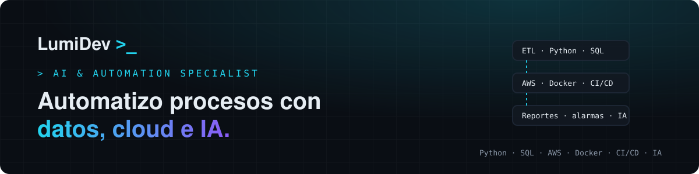

<a href="https://lumidev.vercel.app">
  
</a>

<p align="center">
  <a href="https://lumidev.vercel.app"></a>
  <a href="https://www.linkedin.com/in/luis-miranda-de-la-guarda/"></a>
  <a href="mailto:lumidev.contact@gmail.com"></a>
</p>

## Hola, soy Luis Miranda 👋

**AI & Automation Specialist** e Ingeniero Civil en Computación, basado en Chile.

Diseño **automatizaciones, integraciones, pipelines de datos y despliegues en la nube** que convierten horas de trabajo manual en minutos. La IA no es un adorno en mi trabajo, es mi método.

> 🌐 Casos de estudio y blog en **[lumidev.vercel.app](https://lumidev.vercel.app)**.

## Impacto

- ⚡ Procesos operativos de **4–5 horas a menos de 5 minutos**.
- 🤖 De **2 operadores a 0**: hoy se ejecutan de forma automática.
- 🔗 **15+ integraciones y automatizaciones** en producción.

## Qué hago

| | |
|---|---|
| 🔄 **Automatización** | Python · n8n · REST APIs · tareas programadas |
| 🔗 **Integraciones y ETL** | pandas · SQL · PostgreSQL · SQL Server |
| 📊 **Datos y reportería** | Snowflake · Power BI · SQL |
| ☁️ **Cloud y DevOps** | AWS · Docker · GitHub Actions · Linux · Vercel |
| 🧩 **Full-stack** | FastAPI · React · Next.js · TypeScript |
| 🧠 **IA aplicada** | Claude Code · Claude API · agentes · skills |

## Stack

<p>
  
</p>

## Cómo trabajo

```text
01 Planificar  → alcance y riesgos antes de tocar código (Claude Code en modo Plan)
02 Revisar     → plan y diff revisados; todo pasa primero por un ambiente de pruebas
03 Desplegar   → contenedores y CI/CD, con ramas por entorno
04 Reutilizar  → si un flujo se repite, se convierte en skill o script reutilizable
```

## Open source en construcción 🚧

Versiones públicas de mis herramientas, reconstruidas con datos sintéticos:

- **`lms-sync-kit`**: ETL de sincronización entre sistemas con detección de diferencias.
- **`gradebook-reports`**: CLI de reportes automatizados en xlsx.
- **`grades-self-service`**: app FastAPI + React para buscar y descargar datos a gran escala.
- **`lms-claude-skills`**: skills de Claude y plantillas n8n para automatizar operaciones.
- **`lms-ops-agent`**: agente de operaciones con la API de Claude.

👉 [Ver casos de estudio](https://lumidev.vercel.app/proyectos) · [Leer el blog](https://lumidev.vercel.app/blog)

## Trayectoria

- **Coordinador de Desarrollo de Plataforma Educativa**, educación superior online · *2025 — actualidad*
- **Ingeniero de Monitoreo y Postventa**, Embedx · *2025*
- **Investigación en visión por computador**, RisLab UOH · *2024*
- **Práctica en Análisis de Datos y Automatización**, Copec S.A. · *2022 — 2023*
- **Ingeniería Civil en Computación**, Universidad de O'Higgins · *2018 — 2024*

---

<p align="center">
  ¿Tienes un proceso que debería funcionar solo? <a href="https://lumidev.vercel.app/#contacto">Conversemos</a>.<br/>
  <sub>Fuera del código, soy músico y compositor 🎵</sub>
</p>
